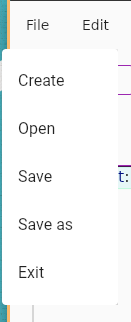
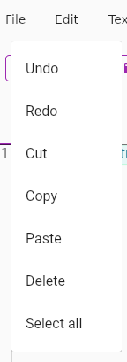
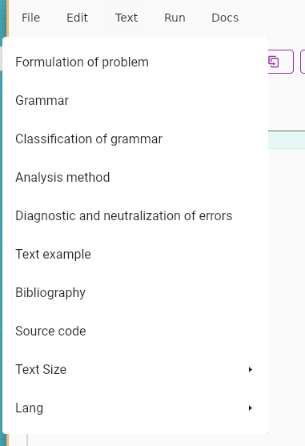
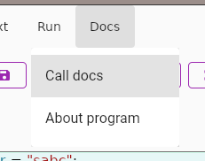
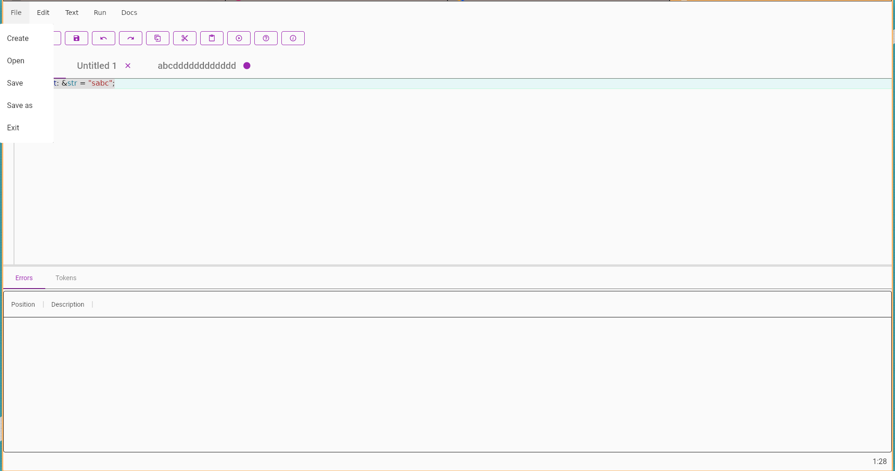
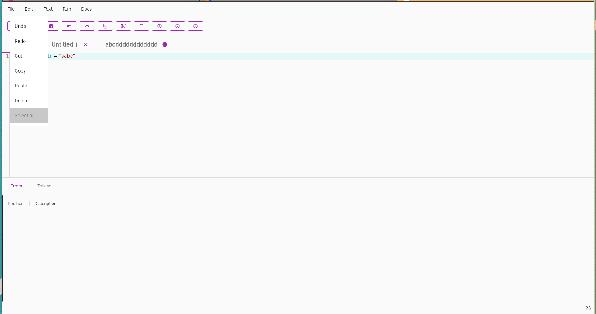
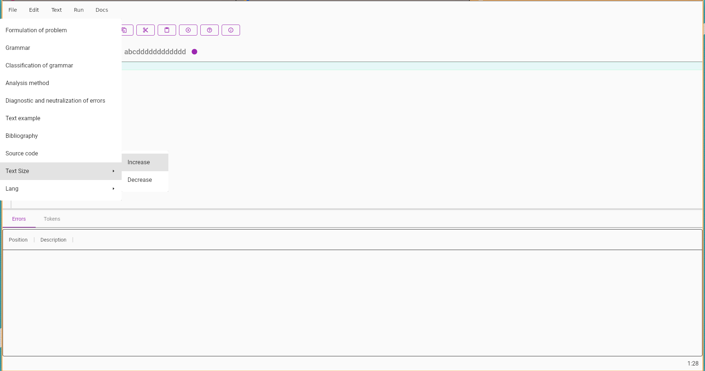
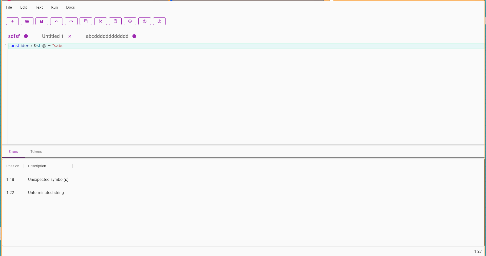
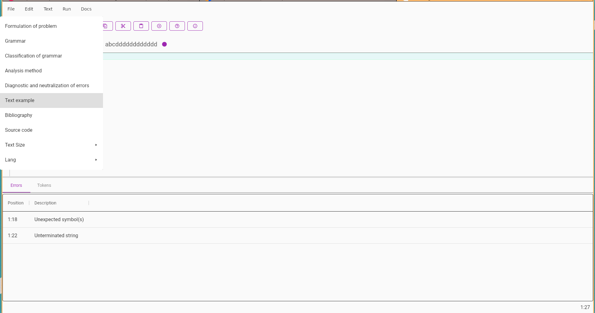
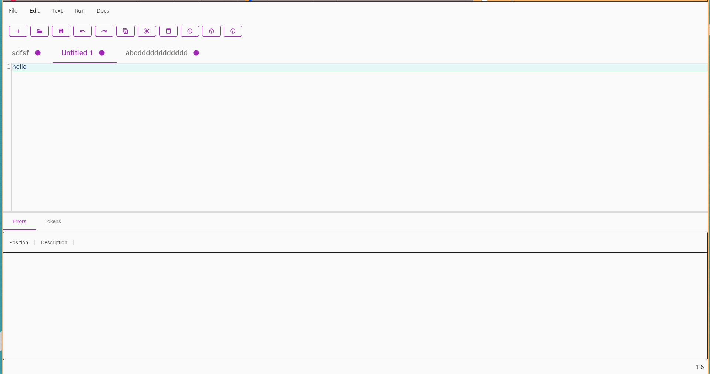

# Compiler Theory

**Compiler Theory** - это приложение для редактирования и анализа кода. Оно предоставляет удобный текстовый редактор с расширенными возможностями, также включает функции анализа кода с поддержкой автодополнения и вывода ошибок компиляции.

**Тема:** Создание текстового редактора с возможностью последующего расширения в направлении языкового процессора.

**Цель работы:** Разработка графического приложения с интерфейсом пользователя для редактирования текстовых данных. Приложение предполагается использовать как основу для будущего расширения функционала в направлении языкового процессора.

**Язык программирования:** C#, Avalonia.

## Возможности

### Текстовый Редактор

- **Меню**
- | Пункт меню | Подпункты                            |
    | ------ |--------------------------------------|
  | Файл |     |
  | Правка |   |
  | Текст |    |
  | Справка |  |

- **Базовые Операции:**
    - Открытие, создание и сохранение файлов.
    - Поддержка множества вкладок для одновременного редактирования различных файлов.

      

- **Редактирование Кода:**
    - Подсветка синтаксиса и автодополнение для улучшенной читаемости кода.
    - Возможность отмены (Undo) и повтора (Redo) действий.
    - Операции копирования, вставки, удаления и выделения текста.

      

- **Настройки Внешнего Вида:**
    - Изменение размера шрифта для удобства чтения.

      

### Анализ Кода

- **Ошибки Компиляции:**
    - Вывод ошибок компиляции в удобном формате.

      

### Другие Функции

- **Открытие Примеров Кода:**
    - Возможность загрузки примеров кода для изучения и экспериментов.

      

- **Поддержка Многозадачности:**
    - Возможность одновременного редактирования и анализа нескольких файлов.

      
      

## Используемые Библиотеки

- [ReactiveUI](https://www.nuget.org/packages/ReactiveUI/) (версия 19.5.41)
- [ReactiveUI.Fody](https://www.nuget.org/packages/ReactiveUI.Fody/) (версия 19.5.41)
- [Avalonia](https://www.nuget.org/packages/Avalonia/) (версия 11.0.6)
- [Avalonia.Controls.DataGrid](https://www.nuget.org/packages/Avalonia.Controls.DataGrid/) (версия 11.0.6)
- [AvaloniaEdit](https://www.nuget.org/packages/AvaloniaEdit/) (версия 11.0.6)
- [Material.Avalonia](https://www.nuget.org/packages/Material.Avalonia) (версия 3.4.0)
- [Material.Avalonia.DataGrid](https://www.nuget.org/packages/Material.Avalonia.DataGrid) (версия 3.4.0)
- [Material.Avalonia.Dialogs](https://www.nuget.org/packages/Material.Avalonia.Dialogs) (версия 3.4.0)
- [Material.Icons.Avalonia](https://www.nuget.org/packages/Material.Icons.Avalonia/) (версия 2.1.0)